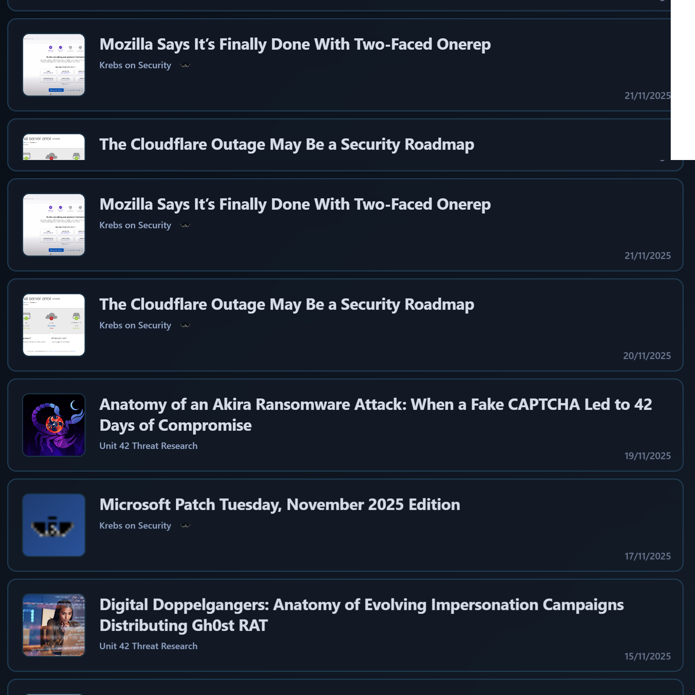

# SOC-FeedViz

Real-time cybersecurity RSS feed dashboard for security operations centers. Live threat intelligence monitoring with auto-scrolling and intelligent image fallbacks.

## ⚠️ Notice

**Provided "as is"** for environments with appropriate security controls. Production-ready with ongoing development.

## 🚀 Core Features

### Real-time Intelligence
- **Multi-source aggregation**: Pulls from major cybersecurity feeds (ACSC, Krebs, Unit 42, etc.)
- **Automatic refresh**: Configurable intervals with live updates
- **Backend caching**: Optimized performance with intelligent caching
- **Connection monitoring**: Tracks feed availability and performance

### Smart Visualization
- **Auto-scrolling**: Continuous and spotlight modes with adjustable speed
- **Image fallbacks**: Domain-specific branded images with intelligent fallback chain
- **Responsive design**: Adapts to different screen sizes and orientations
- **Dark/Light themes**: Customizable color schemes

### Monitoring & Debug
- **Debug menu**: Accessible via bottom-left corner toggle
- **Real-time statistics**: Feed health, performance metrics, and image fallback tracking
- **Live controls**: Adjust scroll speed, pause, and refresh feeds on demand

## 🎬 Demo



[▶️ Watch Demo Video](demo/demo_v0.5.mp4)

## Quick Start

```bash
git clone https://github.com/sweets9/SOC-FeedViz.git
cd SOC-FeedViz
npm install
cd backend && npm install && cd ..
npm run start:all
```

**Access**: http://localhost:3005 | **API**: http://localhost:3003/api/feeds

## Configuration

Edit `config.json` for feeds, image fallbacks, and display settings:

```json
{
  "feeds": [...],
  "imageFallbacks": {"domain": "image_url"},
  "refreshInterval": 900000,
  "scrollSpeed": 30
}
```

## 🗺️ Planned Features

**Security**: SSO, IP whitelisting, authentication, API lockdown  
**Features**: Web admin UI, remote display, highlighting, multiple layouts  
**Hardening**: Package reduction, security code review, API tokenization

## 📋 Documentation

**Technical docs**: [TECHNICAL.md](TECHNICAL.md) - Architecture, API, development

## 🚀 Deployment

```bash
npm run dev          # Development
npm run build        # Production build
npm run preview      # Preview build
```

**Production**: Use nginx.example.conf for reverse proxy setup

## 🔧 Monitoring

**Debug menu**: Bottom-left corner toggle  
**API**: `/api/feeds`, `/api/status`, `/api/refresh`

## 🤝 Contributing

1. Fork → 2. Feature branch → 3. Commit → 4. Push → 5. Pull request

**Areas**: Security, features, documentation, testing

## ⚠️ Security Notice

**"As is" software** - Deploy with appropriate security controls. Conduct security assessment for production use.

## 📄 License

**AGPL-3.0** - See [LICENSE](LICENSE) file

---

**SOC-FeedViz** - Real-time cybersecurity intelligence visualization | MVP++
